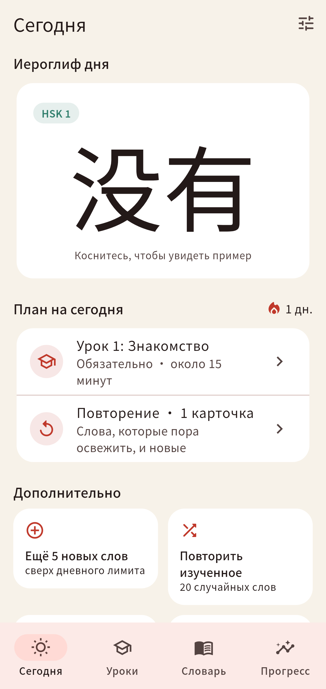
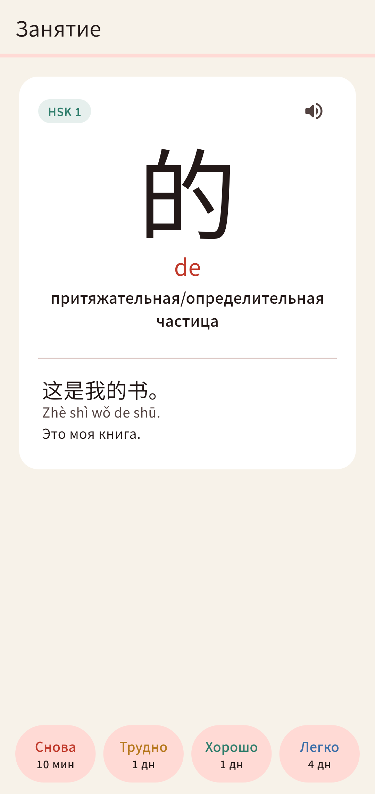
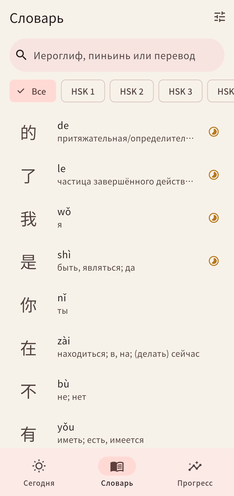
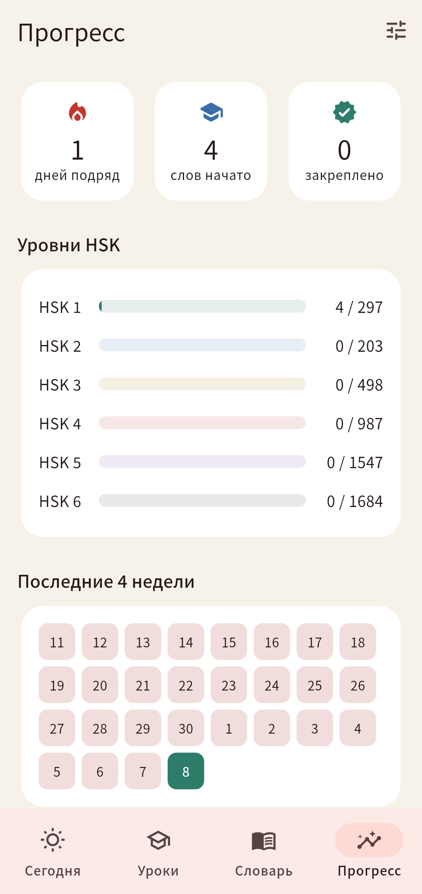

# Сюэцзы (学字)

Приложение для ежедневного изучения китайских иероглифов. Слова появляются
на экране блокировки и в виджете на рабочем столе, а повторения строятся по
интервальному алгоритму.

<p>




</p>

## Что умеет

- **Иероглиф дня**: пиньинь, перевод на русский, пример с переводом, озвучка.
- **Экран блокировки**: уведомления со словом по расписанию (каждые 30 мин, 1, 2 или 3 часа, в выбранные часы). Нажатие открывает карточку слова.
- **Виджеты**: на Android на рабочем столе, на iPhone на рабочем столе и на экране блокировки (iOS 16+). Слово меняется само в течение дня, даже когда приложение закрыто.
- **Интервальное повторение** (упрощённый SM-2): кнопки «Снова / Трудно / Хорошо / Легко» с подсказкой следующего интервала.
- **HSK 3.0, уровни 1–6**: 5216 слов с русским переводом и примером, выбор уровней и количества новых слов в день.
- **Уроки HSK 1**: 10 тем со словами, грамматикой, диалогом и упражнениями (значение, иероглиф, на слух, тоны, сборка фразы).
- **План дня**: один обязательный урок, повторение и домашнее задание (прописи иероглифов из урока). После плана: ещё новые слова, повторение изученного, тренировка тонов, прописи.
- **Порядок черт и разбор**: анимация написания, из каких частей состоит иероглиф, ключ, смысловая и звуковая части; прописи пальцем с проверкой каждой черты.
- **Прогресс**: серия дней, прогресс по уровням, календарь занятий.
- **Словарь** с поиском по иероглифу, пиньиню (можно без тонов) и переводу.
- **Прописи** пальцем: касание срабатывает сразу, каждая черта проверяется, есть подсказка и анимация «Как писать».
- **Переход к слову**: нажатие на уведомление или виджет открывает именно это слово.
- **Аккаунт**: вход по почте, прогресс сохраняется в облаке (Supabase) и возвращается после переустановки. Без аккаунта есть резервная копия кодом.
- Тёмная тема, онбординг с выбором уровня и темпа.

## Как собрать

Нужны Flutter 3.47+ (stable) и Android Studio (Android SDK).

```bash
flutter pub get
flutter run                 # на подключённом телефоне или эмуляторе
flutter build apk --release # APK: build/app/outputs/flutter-apk/app-release.apk
```

Без своей среды: загрузите проект в репозиторий GitHub, и workflow
`.github/workflows/build-apk.yml` соберёт APK (вкладка Actions, Build APK,
Artifacts).

### iPhone

Нужен Mac с Xcode 16+ или GitHub Actions (`.github/workflows/build-ios.yml`
собирает неподписанный `xuezi-unsigned.ipa`).

- **Mac + Xcode**: откройте `ios/Runner.xcworkspace`, у целей Runner и
  HanziWidget выберите свою команду (Signing & Capabilities) и запустите на
  подключённом iPhone. Бесплатного Apple ID хватает, приложение работает 7 дней,
  потом его нужно переустановить.
- **Windows или Mac без Xcode**: скачайте `xuezi-unsigned.ipa` из Actions и
  установите через Sideloadly со своим Apple ID (те же 7 дней).
- **TestFlight / App Store**: нужен Apple Developer Program (99 $ в год).

Если бандл `app.xuezi.xuezi` занят, поменяйте его и App Group
`group.app.xuezi.xuezi` (в `lib/services/lockscreen.dart`,
`ios/HanziWidget/HanziWidget.swift` и двух `.entitlements`).

На iPhone виджет на экран блокировки добавляется так: долгое нажатие на экран
блокировки, «Настроить», «Экран блокировки», «Добавить виджеты», «Сюэцзы».

## Аккаунты (Supabase)

1. Зарегистрируйтесь на supabase.com и создайте проект (бесплатный план).
2. SQL Editor → вставьте `tool/supabase.sql` → Run.
3. Authentication → Sign In / Providers → Email: по желанию выключите «Confirm email», чтобы вход работал без письма.
4. Project Settings → API: адрес проекта и ключ `anon public` впишите в `lib/services/cloud_config.dart` (или передайте при сборке `--dart-define=SUPABASE_URL=... --dart-define=SUPABASE_ANON_KEY=...`).

Пока ключи не указаны, в настройках доступна только резервная копия кодом.

## Устройство

```
lib/
  main.dart                 вход, навигация
  data/word.dart            модель слова
  srs/srs.dart              алгоритм повторений
  state/app_state.dart      прогресс, настройки, очередь занятия
  services/lockscreen.dart  уведомления на экране блокировки и данные виджета
  services/speech.dart      озвучка (синтезатор речи телефона)
  ui/                       экраны
android/app/src/main/kotlin/.../HanziWidgetProvider.kt  виджет Android
ios/HanziWidget/HanziWidget.swift                       виджеты iOS (WidgetKit)
assets/words.json           словарь
```

## Что дальше

- Уроки для HSK 2–6.
- Свои списки слов, синхронизация между устройствами.
- Кнопки «Знаю / Не знаю» прямо в уведомлении.

## Источники данных

- Списки HSK 3.0: [complete-hsk-vocabulary](https://github.com/drkameleon/complete-hsk-vocabulary) (MIT).
- Порядок черт и разбор иероглифов: [Make Me a Hanzi](https://github.com/skishore/makemeahanzi) (графика — Arphic Public License, словарь — LGPL).
- Английские значения: CC-CEDICT (CC BY-SA 4.0).
- Русские переводы и примеры написаны для этого проекта (сгенерированы ИИ, стоит выборочно проверить).
